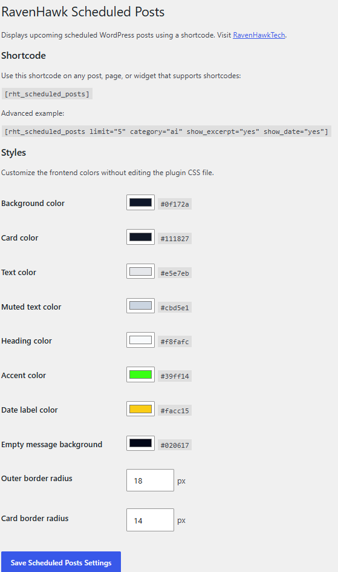
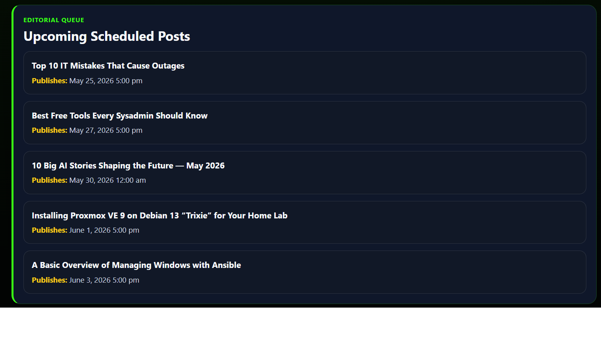

# RavenHawk Scheduled Posts

Dark-theme-safe WordPress shortcode plugin for displaying upcoming scheduled posts.

This repository contains the RavenHawk Scheduled Posts plugin package, update manifest, screenshots, and repository documentation for RavenHawkTech.

## Current Version

**v2.0.1**

## Features

- Displays upcoming scheduled WordPress posts
- Shortcode support with `[rht_scheduled_posts]`
- Optional category filtering
- Optional date display
- Optional excerpt display
- Optional editor links for users who can edit posts
- RavenHawkTech admin menu grouping
- Admin page with shortcode reference
- Editable frontend style controls
- GitHub manifest-based update metadata

## Screenshots

### Admin Settings



### Frontend Preview



## Shortcode

```text
[rht_scheduled_posts]
```

Advanced example:

```text
[rht_scheduled_posts limit="5" category="ai" show_excerpt="yes" show_date="yes"]
```

## Admin Settings

Open:

```text
RavenHawkTech → Scheduled Posts
```

The admin page displays the shortcode and includes frontend style controls.

## Repository Structure

This repository tracks the plugin package instead of the extracted plugin source files.

```text
/
├─ README.md
├─ SECURITY.md
├─ COPYRIGHT.md
├─ releases/
│  └─ rht-scheduled-posts.zip
├─ screenshots/
│  ├─ README.md
│  ├─ scheduled-posts-admin-settings.png
│  └─ scheduled-posts-frontend-preview.png
└─ updates/
   └─ rht-scheduled-posts.json
```

The package contains the full WordPress plugin folder, including the plugin PHP file, stylesheet, admin icon assets, and plugin readme.

## Installation

1. In WordPress Admin, go to **Plugins → Add Plugin**.
2. Click **Upload Plugin**.
3. Choose the RavenHawk Scheduled Posts package.
4. Click **Install Now**.
5. Activate the plugin.
6. Open **RavenHawkTech → Scheduled Posts** in WordPress Admin.

## Support RavenHawkTech

<a href="https://www.buymeacoffee.com/wbakke7496c" target="_blank"></a>

## RavenHawkTech

Website: https://ravenhawktech.com

## License

GPL-2.0-or-later unless otherwise noted.
